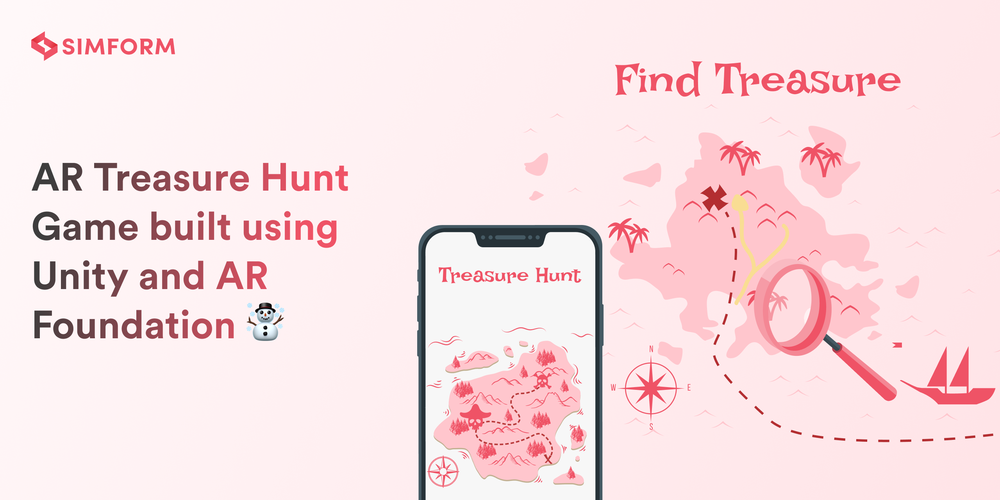
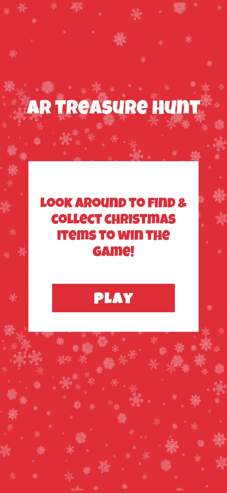
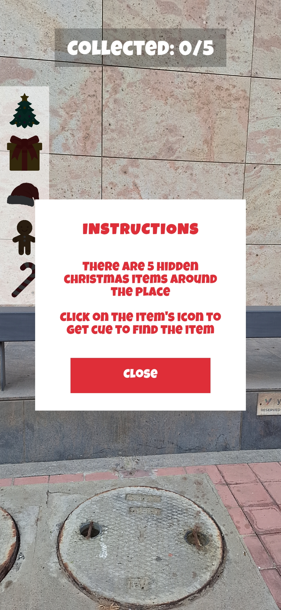
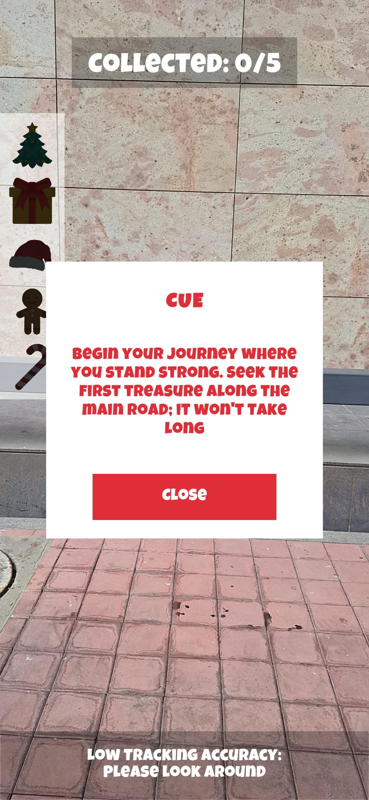
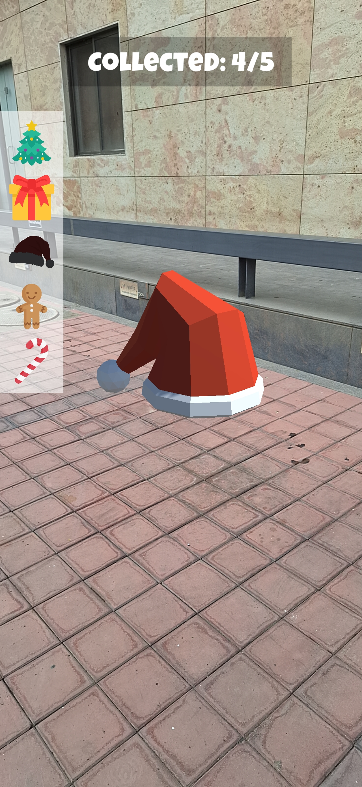
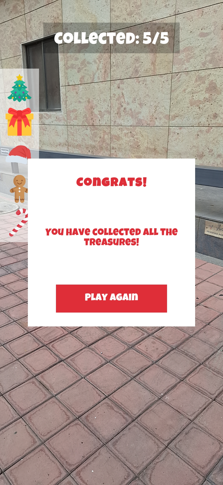

# 🎄AR Treasure Hunt 🎄🎅🏻🎁

[](https://unity3d.com)
[](https://dotnet.microsoft.com/en-us/learn/csharp)
[](https://img.shields.io/badge/API-24%2B-brightgreen.svg?style=flat)
[](https://www.android.com/)

A Christmas themed Augmented Reality based Treasure - Hunt Game built using Unity and AR Foundation ☃️

There are Christmas themed items placed in the real world. Your task is to find out the items following the cues.

## Features 🎉

* [Geospatial Creator API][ARCore Geospatial Creator API] is used to place 3D models of Christmas Items at specific geolocations
* Cues to discover Christmas items
* Score system to track user's current progress
* Notification system to inform user if there is low GPS accuracy, no Internet connectivity
* Animations

## Technologies & Frameworks 🛠

* Unity Engine
* AR Foundation
* Google's ARCore Geospatial Creator Feature
* GPS and LocationService
* Enhanced Input System for handling touch events
* Particle System for Confetti animations

## Screenshots 🤖

|                    Play Game                     |                     Instructions                     |                     Cue                     |
| :----------------------------------------------: | :--------------------------------------------------: | :-----------------------------------------: |
|  |  |  |

|                  Playing Game                   |                  Christmas Item Visible                  |                    Congrats Message                     |
| :---------------------------------------------: | :------------------------------------------------------: | :-----------------------------------------------------: |
|  |  |  |

## Video 🎥

|                                                                   Game Play                                                                   |
| :-------------------------------------------------------------------------------------------------------------------------------------------: |
| <video src="https://github.com/SimformSolutionsPvtLtd/SS-ARTreasureHunt/assets/125339267/d792986c-dfe3-43b9-aad1-1b1fbe02d81b" width=260px /> |

## How does it works? 🧐

The AR Treasure Hunt project can be built to create a mobile game.

The project uses Unity 2022.3.15f1 and Google's ARCore Geospatial Creator API

The [Geospatial Creator API] anchors christmas items to specific GPS coordinates in the real world. The API can track a user's latitude, longitude and altitude on the earth. The user needs to follow the given cues inorder to discover the items.

> [!NOTE]  
> App works best in day time.

## Requirements 🎯

The app will require the following:

* Internet and GPS access.
* The experience works best outdoors.
* An [ARCore compatible device]: Android: Google Pixel 2 or later device for optimum performance.

## Developer Setup 👨‍💻

### Unity 👾

1. [Download Unity version 2022.3.15f1] for compatibility. We recommend using [Unity Hub].
2. Clone this repo to your machine (optionally fork this repository if you plan on expanding on it).
3. Open the project in Unity 2022.3.15f1, and open the 'ARTreasureHunt' scene (if it doesn't open automatically).
4. Switch platform to Android (File > Build Settings > Choose Android Platform > Click on Switch Platform)
5. Follow the steps below in the 'ARCore API Key' section
6. Deploy it to an [ARCore compatible device] (File > Build Settings > Build & Run)

### ARCore API Key 🔑

You'll need to set up API access to use the ARCore Geospatial API and the Google Map Tiles API 

1. Create a new [Google Cloud project][Create Google Cloud Project].
2. Enable the [ARCore API][ARCore API] and [Maptiles API][Google Map Tiles API] and [generate API keys].
3. Add the keys to your Unity Project:
   1. Open Unity Project Settings (Edit > Project Settings)
   2. Under 'XR Plug-in Management', click on 'ARCore Extensions'
   3. Paste the ARCore API Key into the 'Android API Key' textfield
   4. 'Geospatial' and 'Geospatial Creator' should be turned on
   5. Open the ARTreasureHunt Scene by Double Clicking it (Projects window > Assets > Scenes)
   6. Click on 'AR Geospatial Creator Origin' from the [Hierarchy window][Hierarchy Window]
   7. Paste the Map Tiles API Key under 'AR Geospatial Creator Script' component in the [Inspector window][Inspector Window]

### Changing the geographic coordinates of Christmas Items ✨

1. Open the ARTreasureHunt Scene by Double Clicking it (Projects window > Assets > Scenes)
2. Click on any Christmas Item Model in the [Hierarchy window][Hierarchy Window] (eg. Christmas_Tree)
3. From the [Inspector window][Inspector Window], look for 'AR Geospatial Creator Anchor' and change the values for latitude, longitude, altitude to your desired location
   * To learn more about Geospatial Creator API, [click here][Geospatial Creator API]

### Changing the cues ⚡️

Find and edit the [ShowCue] script to show proper cues according to the Christmas Item placement

## Find this project useful? ❤️

Support it by joining [stargazers] for this repository.⭐

## How to Contribute? 🤝

Whether you're helping us fix bugs, improve the docs, or a feature request, we'd love to have you! 💪
Check out our [Contributing Guide] for ideas on contributing.

## Bugs and Feedback 🐞

For bugs, feature requests and discussion use [GitHub Issues].

## Awesome Mobile Libraries 📱
- Check out our other available [awesome mobile libraries][Awesome Mobile Libraries]

## Credits 🧩

* Thanks [Takashi Yoshinaga] for this awesome starter project [GeospatialAPI-Unity-StarterKit]
* [Youtube video][Google AR & VR Geospatial Creator Video] by Google AR & VR team explaining Geospatial Creator API was very helpful 
* Also thanks to amazing [Unity community] for providing lots of useful resources

## License 🔑

```
MIT License

Copyright (c) 2023 Simform Solutions

Permission is hereby granted, free of charge, to any person obtaining a copy
of this software and associated documentation files (the "Software"), to deal
in the Software without restriction, including without limitation the rights
to use, copy, modify, merge, publish, distribute, sublicense, and/or sell
copies of the Software, and to permit persons to whom the Software is
furnished to do so, subject to the following conditions:

The above copyright notice and this permission notice shall be included in all
copies or substantial portions of the Software.

THE SOFTWARE IS PROVIDED "AS IS", WITHOUT WARRANTY OF ANY KIND, EXPRESS OR
IMPLIED, INCLUDING BUT NOT LIMITED TO THE WARRANTIES OF MERCHANTABILITY,
FITNESS FOR A PARTICULAR PURPOSE AND NONINFRINGEMENT. IN NO EVENT SHALL THE
AUTHORS OR COPYRIGHT HOLDERS BE LIABLE FOR ANY CLAIM, DAMAGES OR OTHER
LIABILITY, WHETHER IN AN ACTION OF CONTRACT, TORT OR OTHERWISE, ARISING FROM,
OUT OF OR IN CONNECTION WITH THE SOFTWARE OR THE USE OR OTHER DEALINGS IN THE
SOFTWARE.
```

<!-- Credits Links -->

[Takashi Yoshinaga]: https://github.com/TakashiYoshinaga
[GeospatialAPI-Unity-StarterKit]: https://github.com/TakashiYoshinaga/GeospatialAPI-Unity-StarterKit/
[Google AR & VR Geospatial Creator Video]: https://youtu.be/MDcyG9MAMAo?si=c2YRZ2RCFQa46-Od
[Unity community]: https://unity.com/community
[stargazers]: https://github.com/SimformSolutionsPvtLtd/SS-ARTreasureHunt/stargazers

<!-- Docs link -->

[Download Unity version 2022.3.15f1]: https://unity.com/releases/editor/archive#download-archive-2022
[Unity Hub]: https://unity.com/download
[ARCore Geospatial Creator]: https://developers.google.com/ar/geospatialcreator
[ARCore Geospatial Creator API]: https://developers.google.com/ar/geospatialcreator
[Geospatial Creator API]: https://developers.google.com/ar/geospatialcreator/unity/quickstart
[ARCore compatible device]: https://developers.google.com/ar/devices
[ARCore API]: https://console.cloud.google.com/apis/library/arcore
[Create Google Cloud Project]: https://console.cloud.google.com/projectcreate
[Google Map Tiles API]: https://console.cloud.google.com/apis/library/tile.googleapis.com
[generate API keys]: https://console.cloud.google.com/apis/credentials
[Hierarchy Window]: https://docs.unity3d.com/Manual/Hierarchy.html
[ShowCue]: /Assets/Scripts/ShowCue.cs
[Inspector Window]: https://docs.unity3d.com/Manual/UsingTheInspector.html
[Github Issues]: https://github.com/SimformSolutionsPvtLtd/SS-ARTreasureHunt/issues
[Contributing Guide]: CONTRIBUTING.md
[Awesome Mobile Libraries]: https://github.com/SimformSolutionsPvtLtd/Awesome-Mobile-Libraries
